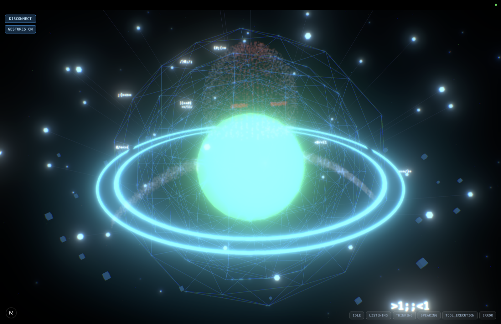

# ⚡ ASHURA v2.0 — Autonomous Situational Desktop AI Assistant

<div align="center">



**Next-Gen AI Desktop Companion · 3D Chibi Holographic Avatar · Real-Time Web Search RAG · Situational Reasoning · MediaPipe Vision Gestures · OS Automation**

[](https://nextjs.org/)
[](https://react.dev/)
[](https://threejs.org/)
[](https://aistudio.google.com/)
[](https://www.typescriptlang.org/)
[](LICENSE)

[Quick Start](#-quick-start) • [Key Capabilities](#-key-capabilities) • [Avatar Customization](#-3d-chibi-avatar--themes) • [Controls & Hotkeys](#-controls--hotkeys) • [Architecture](#-system-architecture)

</div>

---

## 🌟 Overview

**ASHURA (Autonomous Situational High-Utility Responsive Assistant)** is an advanced, cyberpunk-themed desktop assistant that combines procedural 3D graphics, real-time speech and vision, live situational web search, and local operating system control into a single unified interface.

It can be run **100% locally and completely free without any API keys**, or connected to **Google Gemini 2.0 Flash**, **Ollama**, **OpenAI**, or **Groq** directly from the HUD.

---

## 🚀 Key Capabilities

### 🌐 1. Live Web Search & Situational Context (Zero-Key RAG)
- Built-in multi-source search pipeline combining **DuckDuckGo Instant Answers & Deep Web Search** with **Wikipedia summaries**.
- Ashura autonomously decides when a question requires real-time information (e.g. current events, sports scores, documentation, troubleshooting, news) and injects live search summaries into its reasoning context.
- **Zero API keys required** for web search — works straight out of the box.

### 🤖 2. Procedural 3D Chibi Avatar & Holographic Cyber Orb
- Fully interactive Three.js 3D character with animated blinking eyes, reactive glowing neon visor, procedural mouth visemes synced to speech synthesis, and natural breathing idle physics.
- **Particle-assembled holographic wings**, rotating outer data rings, volumetric bloom shaders, and chromatic aberration post-processing.
- Dynamically shifts color, pulsing rate, and animation across 6 core states:
  - `IDLE` (Deep cyan aura, steady respiration)
  - `LISTENING` (Electric blue vibration, receptive ring rotation)
  - `THINKING` (Pulsing amber/gold neural calculation)
  - `SPEAKING` (Vibrant cyan/green amplitude-modulated mouth & core sync)
  - `TOOL_EXECUTION` (High-frequency purple warp drives for OS command runs)
  - `ERROR` (Crimson alarm pulse with automatic self-recovery)

### 🧠 3. Multi-Engine AI Brain Architecture
Configure Ashura's AI provider on the fly via the in-app **Brain Configuration HUD** or `.env.local`:
- **Google Gemini 2.0 Flash** *(Recommended)*: Lightning-fast situational reasoning, context understanding, and zero hallucination web synthesis using free Google AI Studio keys.
- **Autonomous Local Model Engine**: Fast, zero-dependency offline fallback engine that handles conversations, avatar switching, and local OS commands without any network connection or API keys.
- **Local Ollama**: Connect to local LLMs (`llama3`, `deepseek-r1`, `mistral`) running on `http://localhost:11434`.
- **OpenAI & Groq**: Compatible with GPT-4o, Llama-3-70b-versatile, and high-throughput Groq endpoints.

### 💻 4. Local OS Diagnostics & Windows Automation
Ashura can interact with and diagnose your local Windows PC directly:
- **Application Launcher**: *"open notepad"*, *"launch calculator"*, *"open chrome"*, *"open code"*, *"open paint"*, *"open explorer"*.
- **System Telemetry**: *"what are my specs?"*, *"show system memory"*, *"check cpu usage"*, *"how is my storage?"*.
- **Safe Command Execution**: Diagnostic system commands (`dir`, `ipconfig`, `whoami`, `systeminfo`).

### 🖐️ 5. MediaPipe AI Hand-Gesture Control
- Real-time webcam tracking powered by **MediaPipe Tasks Vision** with seamless GPU/CPU fallbacks.
- **Pinch-to-zoom**: Bring thumb and index together to zoom into Ashura's holographic cockpit.
- **Spatial Rotation**: Move your hand across the camera frame to rotate the 3D avatar smoothly.

### 🎙️ 6. Real-Time Voice Link & Amplitude Sync
- Continuous browser-native Web Speech recognition and vocal synthesis.
- Live audio amplitude analyzer that pulses Ashura's core and mouth in direct sync with spoken responses.

### 📊 7. Dynamic 3D Neural Memory Graph
- Ashura actively parses conversational entities, technical concepts, and user preferences into a persistent 3D knowledge graph orbiting the avatar in real-time.

---

## ⚡ Quick Start

### Option A: Windows 1-Click Launcher (Easiest)
Simply double-click:
```cmd
run.bat
```
or run in Windows PowerShell:
```powershell
powershell -ExecutionPolicy Bypass -File .\run.ps1
```
*The launcher checks your environment, installs dependencies if needed, and automatically launches your default browser to `http://localhost:3000`.*

---

### Option B: Cross-Platform (Windows, macOS, Linux)

1. **Clone the repository**:
   ```bash
   git clone https://github.com/sudo-shakuni/Ashura.git
   cd Ashura
   ```

2. **Install dependencies**:
   ```bash
   npm install
   ```
   *(On Windows PowerShell, use `npm.cmd install` if execution policy restricts npm)*

3. **Start development server**:
   ```bash
   npm run dev
   ```

4. **Open in Browser**:
   Navigate to [http://localhost:3000](http://localhost:3000).

---

## 🔑 AI Provider Configuration (Optional)

Ashura works **immediately out-of-the-box** without any keys. To upgrade Ashura with Gemini 2.0 Flash or other models:

### Method 1: In-App HUD (No Restart Needed)
1. Click the **`[🧠 BRAIN]`** button in the top HUD or press `T` to open the dock.
2. Select your provider (**Google Gemini**, **OpenAI**, **Groq**, or **Ollama**).
3. Paste your free [Google AI Studio API Key](https://aistudio.google.com/) and click **Save**.

### Method 2: Environment File
Create a `.env.local` file in the project root:
```env
# Google Gemini (Recommended - Free at https://aistudio.google.com/)
GEMINI_API_KEY=your_gemini_api_key_here

# Or OpenAI
# OPENAI_API_KEY=your_openai_api_key_here

# Or Groq
# GROQ_API_KEY=your_groq_api_key_here

# Or Local Ollama
# OLLAMA_HOST=http://localhost:11434
```

---

## 🎨 3D Chibi Avatar & Themes

You can customize Ashura's appearance in real-time by chatting or typing commands:

| Command / Trigger | Visual Effect |
|---|---|
| *"switch to cyber theme"* / *"original"* | **Cyber Ashura**: Cyan neon visor, dark hoodie, holographic cyan energy rings. |
| *"switch to mecha titan"* / *"heavy armor"* | **Mecha Titan**: Amber battle visor, gold titanium chest plate, sunburst particle corona. |
| *"switch to shadow ninja"* / *"stealth mode"* | **Shadow Ninja**: Crimson stealth visor, obsidian carbon armor, dark stealth aura. |
| *"switch to neon angel"* / *"angel mode"* | **Neon Angel**: Pink holo visor, ethereal lavender wings, starburst particle halo. |
| *"turn visor green"* / *"make eyes purple"* | Live procedural recoloring of visor, skin, clothing, and background aura. |

---

## 🎮 Controls & Hotkeys

| Key / Control | Function |
|:---:|---|
| <kbd>T</kbd> | Toggle Command Dock & Text Chat Prompt |
| <kbd>V</kbd> | Toggle Voice Assistant (Microphone & TTS Speech Link) |
| <kbd>G</kbd> | Toggle MediaPipe AI Hand-Gesture Tracking |
| <kbd>C</kbd> | Toggle Webcam Preview Picture-in-Picture |
| <kbd>D</kbd> | Toggle HUD Telemetry & Diagnostics |
| <kbd>R</kbd> | Reset 3D Camera Orbit to Default Center |
| <kbd>+</kbd> / <kbd>−</kbd> | Zoom 3D Camera In / Out (Supports Numpad) |
| **Mouse Drag** | Free 3D Orbit & Rotation |
| **Mouse Scroll** | Precision Distance Zoom |
| **Pinch Gesture** | Optical Zoom In/Out via Webcam Hand Tracking |

---

## 🏗️ System Architecture

```
app/
├── api/agent/route.ts      # Multi-engine orchestrator: Gemini 2.0 Flash, Local Model, Web RAG, Windows tools
├── layout.tsx              # Root HTML shell & viewport metadata
└── page.tsx                # Dynamic client entry point for AshuraOrb
components/
└── AshuraOrb.tsx           # Main HUD view, Three.js canvas, gesture sync, speech synthesis & settings
lib/
├── chibiAvatar.ts          # Procedural 3D Chibi avatar mesh generator (head, eyes, visor, hoodie, wings)
├── webSearch.ts            # DuckDuckGo & Wikipedia live contextual search RAG engine
├── localModel.ts           # Built-in zero-config autonomous situational intelligence engine
├── orbScene.ts             # Three.js scene manager, shader materials, post-processing bloom stack
├── handTracker.ts          # MediaPipe Tasks Vision hand-tracking processor
├── voiceAssistant.ts       # SpeechRecognition & SpeechSynthesis audio coordinator
└── types.ts                # TypeScript schemas for agent states, tools, and visual themes
run.bat                     # 1-Click Windows Batch Launcher
run.ps1                     # 1-Click Windows PowerShell Launcher
.env.local.example          # Sample environment key configurations
```

---

## 🛡️ Privacy & Safety
- **Local First**: All speech recognition and hand tracking runs entirely inside your browser. No video frames are ever recorded or transmitted to external servers.
- **Sandboxed Tool Execution**: The OS automation suite enforces safe commands (whitelist-controlled application launches and system queries). Destructive commands (`del`, `rmdir`, `format`, etc.) are blocked.

---

## 📜 License

Distributed under the **MIT License**. Free for personal and educational use.

---

<div align="center">
Built with ❤️ by <b>Sudo Shakuni</b> · Powered by Next.js, Three.js & Google Gemini
</div>
